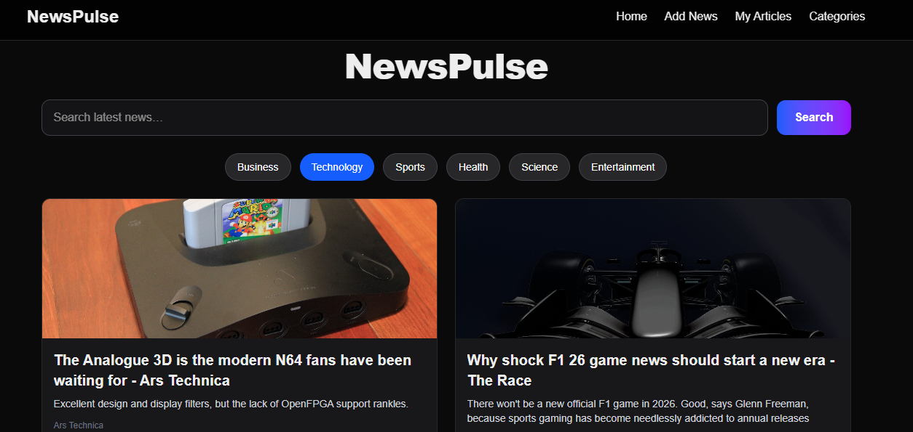
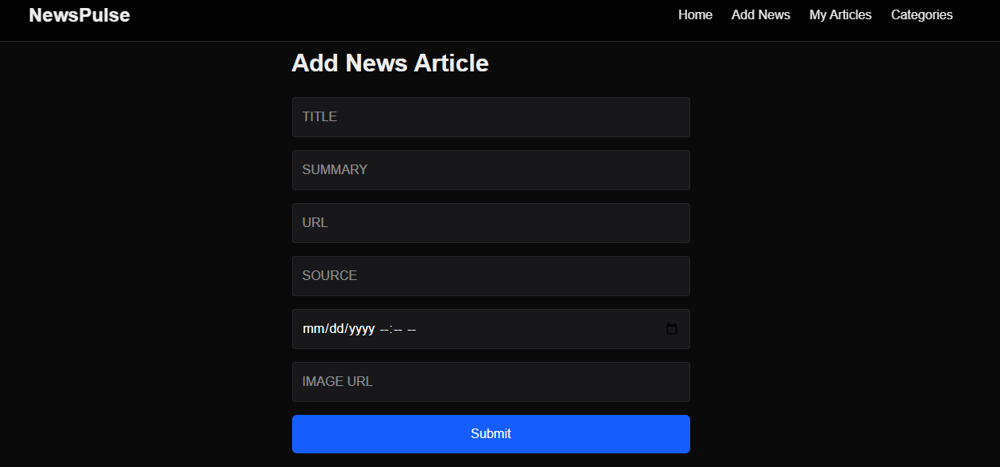
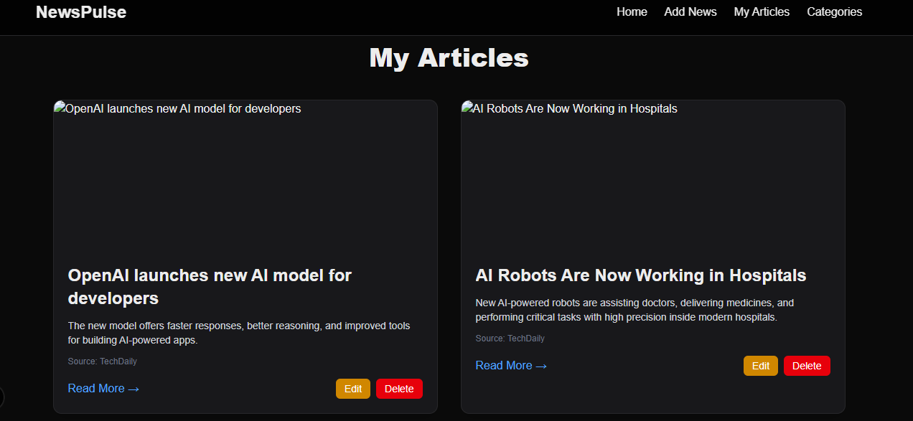
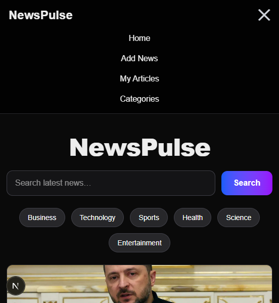

# 📰 NewsPulse  
A modern news portal that fetches **live news** from NewsAPI and allows users to **search**, **filter by category**, **paginate**, and manage **custom articles** using a Django REST backend and a Next.js frontend.

---

## 🚀 Project Overview

The project demonstrates:
- Fetching real-time news from **NewsAPI**
- Search functionality with keyword filtering
- Category-based browsing
- Pagination (Load More)
- CRUD operations for internal custom articles
- Mobile-responsive UI
- Clean and modern design using TailwindCSS & Next.js
- Secure backend proxy for API requests

---

## 🧠 Features

### ✅ **1. Live News Fetching**
Fetches the latest US headlines from **NewsAPI.org** using a Django proxy (keeps API key hidden).

### ✅ **2. Search Functionality**
Users can search news by entering any keyword (e.g., "AI", "Technology").

### ✅ **3. Category Filtering**
Categories supported:
- Business  
- Technology  
- Sports  
- Health  
- Science  
- Entertainment  

### ✅ **4. Pagination**
"Load More" button dynamically fetches the next page of results.

### ✅ **5. Internal Articles (CRUD)**
Users can:
- Create articles  
- View articles  
- Edit articles  
- Delete articles  

These are stored inside Django’s database and displayed in **My Articles**.

### ✅ **6. Clean & Responsive UI**
- Fully mobile responsive  
- Modern gradient cards  
- Hover animations  
- Glass-effect navbar  
- Hamburger menu for mobile  

### ✅ **7. Secure Backend Proxy**
Frontend never exposes the NewsAPI key — all requests go through Django.

---

## 🛠️ Tech Stack

### **Frontend**
- Next.js 14 (App Router)
- React
- Tailwind CSS
- TypeScript

### **Backend**
- Django 5
- Django REST Framework
- SQLite (default)
- CORS Headers

### 🔐  **API Security**
- NewsAPI.org (via Django proxy)
- API keys stored in .env
- .env added to .gitignore
- No secrets exposed on GitHub
  

## 📂 Project Structure

```
NewsPulse/
│
├── backend/
│   ├── apps/
│   │   └── news/
│   │       ├── models.py
│   │       ├── serializers.py
│   │       ├── views.py
│   │       └── urls.py
│   ├── core/
│   │   ├── settings.py
│   │   ├── urls.py
│   │   ├── wsgi.py
│   ├── manage.py
│   └── venv/
│
├── frontend/
│   ├── app/
│   │   ├── page.tsx
│   │   ├── add-article/
│   │   ├── my-articles/
│   │   ├── categories/
│   │   └── news/[id]/
│   ├── components/
│   │   ├── Navbar.tsx
│   │   └── NewsCard.tsx
│   ├── lib/newsapi.ts
│   ├── public/
│   └── package.json
│
└── README.md
```

## ▶️ How to run the project locally
```
- git clone https://github.com/YOUR_USERNAME/NewsPulse.git
- cd NewsPulse

### **Backend Setup**

- cd backend
- python -m venv venv
- venv\Scripts\activate   # For Windows(Powershell)
- source venv/bin/activate # For macOS/Linux(GitBash)
- pip install -r requirements.txt

## Inside the "backend" root folder, create a file named .env and input the following code:

  DEBUG=True
  DJANGO_ALLOWED_HOSTS=127.0.0.1,localhost 
  NEWS_API_KEY=YOUR_NEWSAPI_KEY_HERE (Replace YOUR_NEWSAPI_KEY_HERE with your secret NewsAPI key)

- python manage.py migrate
- python manage.py runserver

## Backend will run at:
👉 http://127.0.0.1:8000

### **Frontend Setup**

- cd frontend
- npm install

## Inside the "frontend" root folder, create a file named .env.local and input the following code:

  NEXT_PUBLIC_BACKEND_URL=http://127.0.0.1:8000

- npm run dev

## Frontend will run at:
👉 http://localhost:3000

```

### 🔥 How It Works

                ┌──────────────────────────┐
                │        User Device       │
                │  Browser / Mobile / PC   │
                └─────────────┬────────────┘
                              │
                              │ (1) Open Website / Request News
                              ▼
                ┌──────────────────────────┐
                │        Next.js App       │
                │  (Frontend - page.tsx)   │
                └─────────────┬────────────┘
                              │
                              │ (2) API request → fetchTopNews()
                              ▼
                ┌──────────────────────────┐
                │      Django Backend      │
                │        /api/news/        │
                │  (Secure Proxy Layer)    │
                └─────────────┬────────────┘
                              │
                              │ (3) Proxy request without exposing API key
                              ▼
                ┌──────────────────────────┐
                │        NewsAPI.org       │
                │   External News Service  │
                └─────────────┬────────────┘
                              │
                              │ (4) JSON Response (latest headlines)
                              ▼
                ┌──────────────────────────┐
                │      Django Backend      │
                │  Clean + Forward Data    │
                └─────────────┬────────────┘
                              │
                              │ (5) Send to Next.js frontend
                              ▼
                ┌──────────────────────────┐
                │        Next.js UI        │
                │ Animated News Cards Load │
                └─────────────┬────────────┘
                              │
                              │ (6) User sees live news
                              ▼
                ┌──────────────────────────┐
                │    Smooth User Experience │
                └──────────────────────────┘


### 📸 Screenshots
###  Homepage

###  Add News

###  My Articles

###  Mobile Navbar


